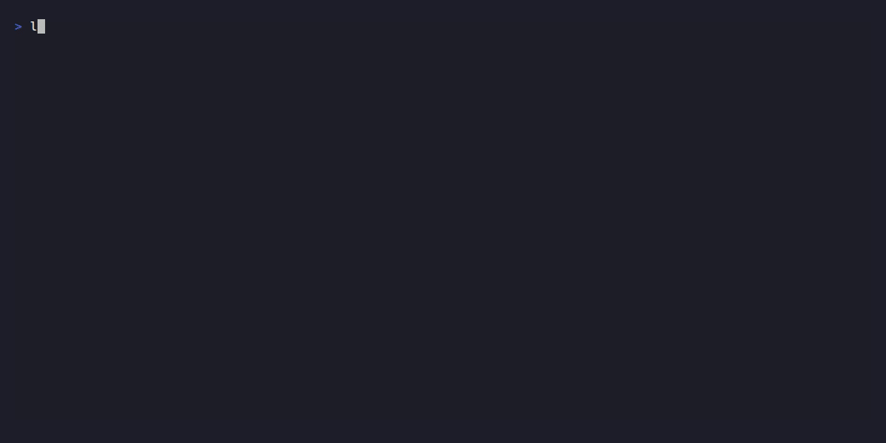

# LaneGate

[](https://pypi.org/project/lanegate/)
[](https://github.com/sudheerdvn/lanegate/actions/workflows/ci.yml)
[](https://www.python.org/downloads/)
[](https://www.apache.org/licenses/LICENSE-2.0)
[](https://modelcontextprotocol.io/)

**Parallel lanes. Protected gates.**
Every agent gets a lane. Nothing ships without a gate.

LaneGate coordinates coding agents (Claude, Codex, Ollama, aider, etc.) working on one repo: every ticket gets its own git worktree, declared `touches` lock the files a ticket owns so a second agent can't claim them, and nothing reaches `main` without an approved review plus whatever guards you configure. Tickets are Markdown files in your repo. No SaaS, no external project state.

**You want this if** you've watched an agent merge something half-baked and found out two commits later, or you've had two agents clobber each other's edits in the same checkout.

The part most tools skip: `pre_merge` guards re-run *against the merged result*, not just the ticket's branch. Two tickets that each passed in isolation but break once combined get caught here — LaneGate resets `main` to its pre-merge commit and routes the ticket back to review instead of leaving a broken commit behind.

LaneGate doesn't plan or implement. Your agents and IDE do that; LaneGate runs the gate around them.

> **Security note.** V1 provides git-level isolation and diff inspection. It does not sandbox agents at the OS level. Agents run as host processes. See [Security Status](#security-status) and [Known Limitations](#known-limitations) before running it on repositories you care about.

---

## Demo



---

## When LaneGate Helps

- keep agent work as local Markdown tickets
- run each task in its own git worktree
- reduce edit collisions with explicit file-level `touches`
- block out-of-scope or sensitive-file changes from auto-merge
- run configured safeguards before completion or merge
- pause for human review before anything lands on `main`

By default, LaneGate commits ticket specs and review verdicts to git as they change. Tickets are a git-native artifact, not local-only state. Executor transcripts, logs, cooldowns, locks, and worktrees stay local under `.lanegate/`. Set `commit_status_changes: false` to opt back into fully zero-footprint local state.

MCP is built in. Run `lanegate mcp` to expose LaneGate commands as native tools for any MCP-compatible agent (Claude, Cursor, etc.), with no shell commands required.

---

## Concepts in 30 seconds

```
.lanegate/tickets/TICK-007.md   ← source of truth (YAML frontmatter)
        │
        ▼
lanegate next         ← agent asks: what should I work on?
lanegate start TICK-007  ← agent claims it; worktree + branch created
  ... agent works in .lanegate/worktrees/tick-007/ ...
lanegate complete TICK-007
lanegate review TICK-007
lanegate merge TICK-007   ← branch → main, worktree removed
lanegate promote production  ← staged deploy with guard/pre/post hooks
```

Main command groups:

| Group | Commands |
|---|---|
| **Scoping**: record work as tickets and ask an executor to infer `touches` / `close_criteria` | `create`, `analyze` |
| **Execution**: who works on what without colliding | `board`, `next`, `start`, `complete`, `review`, `merge` |
| **Delivery**: how merged code reaches environments | `promote`, `pipeline-status`, `flag` |

That's the happy path. For the full state machine — every status, what blocks each transition, where a ticket lands when a guard or review fails, and how many review rounds run — see [docs/lifecycle.md](docs/lifecycle.md).

---

## Security Status

LaneGate is experimental software for coordinating coding agents on a local repo. Before letting it run without review, read this section.

**What LaneGate does to limit agent scope:**
- Runs each agent in a dedicated git worktree, one per ticket
- Enforces a `touches` list: files committed outside the declared scope route to `needs_review`
- Hard-blocks writes to CI/CD configs, dependency manifests (Python, JS/Node, Rust, Go, Java/Gradle, Ruby, PHP, .NET), and credential-shaped files (`.env`, `*.pem`, `secrets.*`)
- Scans ticket text for prompt injection signals before dispatch
- Optionally runs gitleaks, semgrep/bandit, pip-audit, npm-audit, composer-audit, and bundler-audit on agent-produced diffs
- Runs configured `safeguards` such as tests or scripts before `complete` and `merge`

**What LaneGate does NOT do:**
- MCP is not a sandbox. `lanegate mcp` exposes ticket lifecycle commands as native tools, and an agent with access to those tools can claim tickets, create branches, and trigger merges. The MCP server authenticates nothing beyond what the MCP client config enforces.
- Host executors inherit host permissions. Agents (Claude Code, aider, Codex) run as the invoking OS user with full filesystem and network access. There is no bwrap, seccomp, or container wrapping.
- The file-based lock is single-machine, single-checkout. Two separate clones on two machines can both claim the same ticket.
- File-level locks are not semantic dependency analysis. Two tickets can touch different files and still break each other through shared APIs, imports, types, schemas, or runtime behavior. Treat `touches` as a practical coordination boundary, not a proof of correctness.

**Recommendation:** use `--human-review final` when running `lanegate run` on any repository with production code. This stops after implementation and requires `lanegate merge <id>` to be run manually after you inspect the diff. To make this the safe default without depending on every invocation remembering the flag, set `default_human_review: final` (or `per_ticket`) in `.lanegate.yml`. An explicit `--human-review` flag still overrides it. Note that a ticket's `autonomy` field also gates the merge step: the default `autonomy: supervised` already pauses every approved ticket for a human merge decision regardless of `--human-review`, and unattended merge only happens when both `--human-review none` and `autonomy: full`/`green`/`yellow` apply — see [docs/config-reference.md](docs/config-reference.md#--human-review-reference) for the full breakdown.

For the full threat model, executor permissions, and safe usage notes, see [SECURITY.md](SECURITY.md) and [docs/security-model.md](docs/security-model.md).

---

## Known Limitations

- **Lock scope is single-machine, single-checkout.** The file-based concurrency lock at `.lanegate/orchestrator.lock` prevents two `lanegate run` runs on the same checkout from racing, but does not coordinate across separate clones or machines.
- **No OS-level sandbox in V1.** Agents run as child processes with full user permissions (no bwrap, seccomp, or container wrapping), regardless of which Claude Code permission mode is configured (see the next bullet for that separate, application-level choice). LaneGate inspects the git diff after the agent exits. It cannot observe what the agent read or sent over the network during execution.
- **Executor permissions come from the executor runtime, not from LaneGate.** `lanegate init` configures Claude Code with a scoped `--allowedTools` set by default so the agent can run headless without interactive prompts, while tools outside that list stay gated. You can instead configure `flags: ["--dangerously-skip-permissions"]`, which disables Claude Code's per-action approval prompts entirely. That's a valid choice for setups like a sandboxed CI runner, but it means the agent acts on anything without confirmation. See [Security Status](docs/security-model.md#headless-permission-options-for-the-claude-executor) for the full set of options.

---

## Platform support

| Platform | Status |
|---|---|
| Linux | Supported, primary development platform |
| macOS | Supported, CI-verified on every push |
| Windows | Core functionality works, but projects using `.sh` executor scripts require WSL |

---

## Install

```bash
pip install lanegate
lanegate init    # scaffold .lanegate/ + .lanegate.yml in your repo
```

`lgt` and `lane` are installed alongside `lanegate` as short aliases for the same command (e.g. `lgt board`, `lane run`). Use `lanegate run` (or `lane run`) to clear the board; `lanegate orchestrate` remains a compatibility alias. If you added `lane` to an existing editable install, run `pip install -e .` once to create the new executable.

Ticket analysis matches candidate files by parsing real symbols — via stdlib `ast` for Python and built-in tree-sitter support for JS/TS, Go, Rust, Java, Ruby, C, and C++. Multi-language symbol parsing is available with every LaneGate installation.

LaneGate is a standalone CLI, not a library you import into a project. [pipx](https://pipx.pypa.io/) is the recommended way to install it, since it isolates the tool's own dependencies from whatever Python environment your project uses:

```bash
pipx install lanegate
lanegate init
```

To run from source:

```bash
git clone https://github.com/sudheerdvn/lanegate
cd lanegate
pip install -e ".[dev]"
```

---

## Quick start

Commit what `lanegate init` scaffolded (`.lanegate.yml`, `.gitignore`, `.lanegate/`) before creating your first ticket — ticket worktrees are created with `git worktree add`, which only ever sees committed content, so an uncommitted `.gitignore` means the first ticket's worktree has none at all:

```bash
git add .lanegate.yml .gitignore .lanegate/
git commit -m "chore: scaffold LaneGate"
```

For real repositories, configure safeguards before you let an executor run. Safeguard commands run in your project's own environment, not LaneGate's, so make sure the test runner is actually installed there first (e.g. `pip install pytest` in a fresh venv) or `pre_complete` fails before the executor gets a chance to do anything:

```yaml
safeguards:
  pre_complete:
    - pytest
  pre_merge:
    - pytest
  post_merge:
    - pytest
```

```bash
# 1. Create a ticket file
cat > .lanegate/tickets/TICK-001.md << 'EOF'
---
id: TICK-001
title: Add rate limiting to the upload endpoint
status: open
priority: 1
touches:
  - src/upload.py
  - src/middleware.py
parallel_safe: true
autonomy: supervised
close_criteria: POST /upload returns 429 after 100 requests/min per user
---

## Background
A single client can saturate the worker pool with rapid uploads.
EOF

# 2. See the board
lanegate board

# 3. Agent claims and works
lanegate start TICK-001
# ... implement in .lanegate/worktrees/tick-001/ ...
lanegate complete TICK-001
lanegate review TICK-001
lanegate merge TICK-001
lanegate validate TICK-001
lanegate done TICK-001

# 4. Deploy
lanegate promote production
```

---

## Commands

```bash
lanegate board                    # see the ticket board and pipeline snapshot
lanegate next                     # choose the next unblocked ticket(s)
lanegate create "Add rate limits" --title "Rate-limit uploads" --autonomy supervised
lanegate start TICK-007           # claim; creates branch + worktree
lanegate complete TICK-007        # code done → code_complete
lanegate review TICK-007          # submit for review → in_review
lanegate merge TICK-007           # merge to main, delete worktree → merged
lanegate run                      # clear eligible work with the configured executor
```

That covers daily use. For planning/reporting, the full ticket lifecycle, deployment,
feature flags, MCP, the local API/UI, the TUI, monitoring daemons, and setup utilities,
see [docs/commands.md](docs/commands.md). `lanegate --help-all` (or `lgt --help-all` /
`lane --help-all`) prints the complete flat command list.

---

## Configuration

`.lanegate.yml` in your repo root, with walk-up discovery so it works from any subdirectory. Covers the delivery profile (`profile: strict` — enforced review independence), executor routing (`claude`, `codex`, `aider`, `ollama`, multi-executor `executor_steps`, dispatch budget caps), `safeguards` (pre/post-merge test gates, including the automatic re-verification against the real merged `main`), UI-ticket visual verification, and deployment `environments`. The Quick Start above shows a minimal `safeguards` block to get going.

See [docs/config-reference.md](docs/config-reference.md) for every supported key, defaults, and a full annotated example, and [docs/executor-capabilities.md](docs/executor-capabilities.md) for the capability matrix across executors (local-model setup, headless flags, sandbox status).

---

## Coordination model

The `touches` list in each ticket is a pessimistic file-level lock scoped to a single git
checkout on a single machine: LaneGate holds the lock from `in_progress` through `in_review`,
releasing only at `merged`, which reduces edit collisions when multiple agents work in
parallel. It is not semantic dependency analysis — two touch-disjoint tickets can still break
each other through a shared API — so treat it as a coordination boundary, not a correctness
proof. See [docs/architecture.md § Touches Lock Invariants](docs/architecture.md#6-touches-lock-invariants)
for the full model, including lockfile-pairing guidance per ecosystem and the concurrency
bugs fixed versus the original orchestrator.

---

## Testing

```bash
python3 -m pytest tests/ -q
```

See [CONTRIBUTING.md](CONTRIBUTING.md#dev-setup) for the full test suite breakdown and the
release-artifact smoke gate.

---

## MCP integration

MCP is built in — `lanegate mcp` starts a stdio server exposing `board()`, `next_ticket()`,
`start()`, `run()`, `merge()`, and the rest of the lifecycle as native tools for any
MCP-compatible agent, no shell commands required. See
[docs/commands.md § MCP server](docs/commands.md#mcp-server) for client config and the full
tool list, and [`docs/agent-tools.md`](docs/agent-tools.md) for supported agent surfaces and
continuation guarantees.

---

## Roadmap

LaneGate's loopback Python API (`lanegate api`) is built and running today, serving board, ticket, diff, and run state as JSON/SSE. The first local UI is still planned as a small add-on launched with `lanegate ui`: a bundled TypeScript frontend over that API for board scanning, ticket detail, blocked/review triage, diffs, run logs, and read-only settings preview. The CLI remains the complete fallback for advanced or custom workflows. The UI is not a SaaS service and does not move project state out of your checkout.

V1 has shipped. Next is the housekeeping wave gating the public repo (Python mypy, a duplicate-drift sweep, an A/B retest — the Go TUI module has no equivalent type-check gate yet), plus coordination-honesty work like AST-based scope hints, executor conformance tests, and stronger sandboxing. See [ROADMAP.md](ROADMAP.md) for the current, maintained list — this section intentionally doesn't duplicate it.

---

## Docs

- `docs/commands.md` — the full command reference: planning/reporting, the ticket lifecycle, deployment, feature flags, MCP, the local API/UI, the TUI, monitoring daemons, and setup utilities
- `docs/lifecycle.md` — the ticket state machine: every status, transition gates, failure edges, the auto-fix review loop, and where rebase does and doesn't happen
- `docs/demo-walkthrough.md` — end-to-end walkthrough: idea → analyze → parallel worktrees → review → merge, using a toy calculator project; includes a dry-run path for users without an executor configured
- `docs/troubleshooting.md` — FAQ and debug steps: executor hangs, stuck tickets, worktree cleanup, lock files, MCP setup, and more
- `SECURITY.md` — security policy, reporting vulnerabilities, and what LaneGate does and does not do
- `docs/security-model.md` — full threat model, trust boundaries, executor permission matrix, MCP trust model, V1 limitations, and safe usage recommendations
- `docs/architecture.md` — built architecture, module map, and design invariants
- `docs/config-reference.md` — supported `.lanegate.yml` keys and defaults
- `docs/executor-capabilities.md` — capability matrix comparing Claude, Codex, Aider, and Ollama across headless support, prompt transport, local model support, auto-commit behavior, and sandbox status
- `docs/v2-interface-boundaries.md` — V1.5 layer boundaries (Python core / local API / UI add-on / optional runner), the `lanegate api` endpoint contract and what's built vs. still design-only, and the Go TUI spike result
- `.lanegate.yml.example` — annotated example configuration

## Contributing

See [CONTRIBUTING.md](CONTRIBUTING.md) — dev setup, testing, and the DCO sign-off (`git commit -s`) required on every commit.
