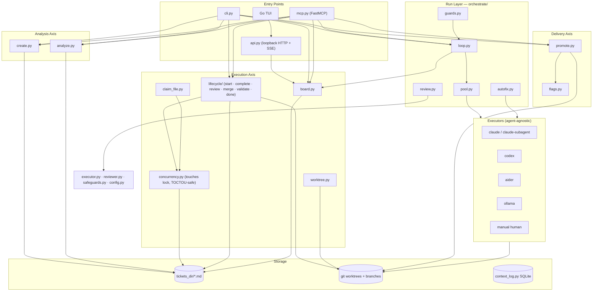
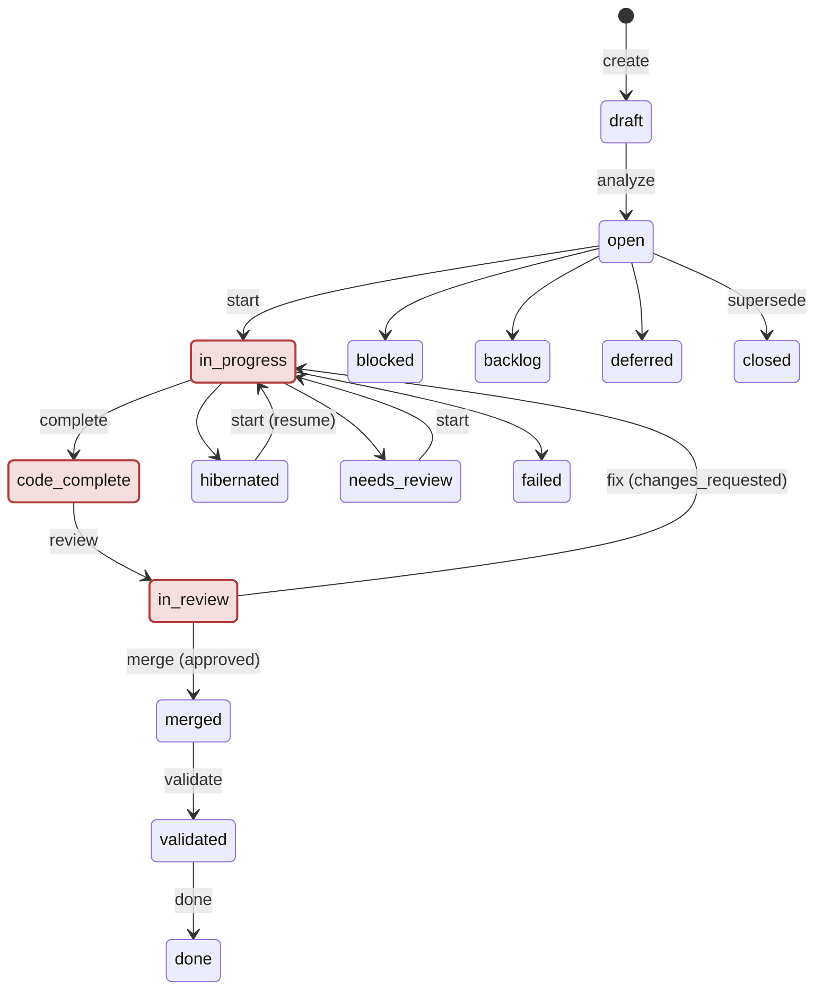

# LaneGate, Architecture Reference

> This document describes **built reality** plus settled design decisions.
> Keep this file updated as new decisions are settled.

---

## 1. The Three Axes

```
┌──────────────────────────────────────────────────────────────────┐
│                    ANALYSIS AXIS  (front door)                   │
│  Turn natural-language intent into a scoped, locked ticket       │
│                                                                  │
│  intent ──► create (draft) ──► analyze ──► touches + close spec  │
│                                   ▲                              │
│                              LLM judgment                        │
│                         (strong model, broad read)               │
└──────────────────────────────────────────────────────────────────┘

┌──────────────────────────────────────────────────────────────────┐
│                    EXECUTION AXIS  (horizontal)                  │
│  Who is working on what, right now, without file collisions      │
│                                                                  │
│  board/next ──► start ──► implement ──► complete ──► merge       │
│                   ▲              ▲           ▲                   │
│               code lock      LLM agent    code drift             │
│              (TOCTOU-safe)  (agent-owned)    check               │
└──────────────────────────────────────────────────────────────────┘

┌──────────────────────────────────────────────────────────────────┐
│                    DELIVERY AXIS  (vertical)                     │
│  Where merged code goes and when it goes live                    │
│                                                                  │
│  main ──► staging ──► production  (via feature flags)            │
│              ▲              ▲                                     │
│          auto hook      promote (guarded ff-only)                │
└──────────────────────────────────────────────────────────────────┘

┌──────────────────────────────────────────────────────────────────┐
│                       RUN LAYER                                  │
│  Batch runner that works through queued tickets                  │
│                                                                  │
│  run ──► next --json ──► executor pool + review gate             │
│  compact terminal progress + full logs under .lanegate/logs         │
└──────────────────────────────────────────────────────────────────┘
```

Direct lifecycle commands (`start`, `complete`, `review`, `merge`, and `fix`) also
receive a stable `action-<timestamp>` reference immediately. Their structured
events live in `.lanegate/logs/action-*.events.jsonl`; `lanegate ps` and the
TUI/API run history list these actions alongside board-clearing runs.

### System Diagram



---

## 2. V1.5 Interface Boundaries

LaneGate remains the local-first orchestration control plane, not a code-writing worker. The Python core owns tickets, locks, lifecycle transitions, orchestration decisions, prompts, executor routing, review gates, analytics, memory, MCP, and the CLI. The local API (`lanegate api`, built against local API design) exposes a subset of those core operations as structured JSON/SSE: board, tickets, diff, and orchestration-run start/stop/status/logs. It exists for a still-unbuilt UI add-on, and that UI must not scrape terminal tables or prose CLI output. Per-ticket lifecycle endpoints and a few read endpoints from the original design remain unimplemented. See [V1.5 Interface Boundaries](v2-interface-boundaries.md) for the built-vs-design gap. A Rust runner remains optional, and it's only justified for security-sensitive process supervision or sandbox enforcement, not as a default rewrite of the Python control plane.

See [V1.5 Interface Boundaries](v2-interface-boundaries.md) for the full layer decision and the rule that older V2 implementation tickets must declare their target layer before work begins.

The same boundary applies to spec-driven development tools: LaneGate can consume and export spec artifacts, but it is not a spec-authoring IDE replacement. It keeps tickets, locks, worktrees, review gates, executor routing, and merge state as LaneGate-owned execution concerns, while imported spec prose remains untrusted ticket context for executors. See [Spec Compatibility Boundary](spec-compatibility.md) for the product boundary, field mapping, trust model, and validation rules.

---

## 3. Code vs LLM Boundary

**Principle:** LLM judgment happens at exactly three nodes. Every coordination and delivery step past that is deterministic code, because a flaky model should never be the one deciding whether a lock conflicts or a merge is safe.

| Step | Who | Notes |
|---|---|---|
| `create` | **Code** | Allocate id, write draft, git commit. Mechanical. |
| `analyze` | **LLM** (configured executor/model) | Intent → `touches` + `close_criteria` + `depends_on`. |
| `board` / `next` | **Code** | Set/graph logic: locked-touches, dependency gating, priority. |
| `start` | **Code** | Lock check, TOCTOU re-read, worktree create, status commit. Accepts tickets in `open`, `hibernated`, or `needs_review`. |
| `claim-file` | **Code** | Lock check + extend: is file already locked? If no → add to touches, commit. |
| implementation | **LLM** (configured executor) | Agent reads `touches`, plans, edits, tests. LaneGate scopes and gates it through `orchestrate`. |
| `complete` | **Code** | Drift check (`git diff` vs touches) + status advance. |
| `review` | **Code or LLM** | CLI records a review verdict. `orchestrate` can invoke a separate review executor in split mode, or require the combined executor to call `lanegate review --verdict ...`. |
| conflict resolution | **LLM / human** | Only triggered when drift breaks the no-conflict invariant. Lock exists so this rarely happens. |
| `merge` | **Code** | `git merge --no-ff`. On conflict: `git merge --abort` + stay in `in_review` (unchanged for genuine source conflicts). A conflict limited to LaneGate-owned ticket metadata (frontmatter/history under `tickets_dir`, `.md` only) can instead be auto-reconciled with `lanegate merge <id> --reconcile`, which preserves trunk's lifecycle-authoritative fields and unions history/audit sections, then completes the merge commit. A ticket branch already an ancestor of trunk (interrupted-merge recovery) skips the second `git merge` entirely and goes straight to post-merge safeguard re-run + finalization. |
| `promote` / `flag` | **Code** | git ops, JSON flag files. |

---

## 4. Module Map

```
lanegate/
├── cli.py          — argument parsing; routes to modules below
├── config.py       — load_config() → plain dict from .lanegate.yml; resolve_model()'s step/executor/ticket-pin resolution order; validate_model_for_executor() checks a resolved model string against the dispatching executor's type and (for `aider`) its declared `provider`, e.g. rejecting a claude-*/gemini-* model against an `aider` executor configured with `provider: ollama`
├── ticket.py       — parse/write/validate ticket markdown+frontmatter; `collect_cross_ticket_change_notes` scans merged/done tickets for overlapping file touches and returns bounded prior change_notes for injection into analyze/implement prompts.
├── board.py        — cmd_board, cmd_next (set/graph logic)
├── lifecycle/      — cmd_start, complete, review, merge, validate, done; direct actions print/persist stable `action-<timestamp>` tracking references. Split from a single ~1900-line lifecycle.py into `__init__.py` (cmd_* entry points), `hibernate.py` (hibernation notes, PR push, executor/recovery markers), and `touches.py` (touched-files/scope-drift compliance check).
├── create.py       — cmd_create (allocate id, write draft, git commit)
├── analyze.py      — cmd_analyze (executor subprocess → touches/close_criteria). Also augments touches with companion docs implied by close_criteria (`companion_docs_from_criteria`, e.g. README/ARCHITECTURE.md mentions) and drops pre-existing touches entries whose directory no longer exists, i.e. renamed/moved/promoted by a since-merged ticket (`validate_touched_paths`).
├── claim_file.py   — cmd_claim_file (dynamic touch expansion, TOCTOU-safe)
├── concurrency.py  — locked_touches, reread_and_assert_open, cross-clone check
├── worktree.py     — create/remove git worktrees
├── companion.py    — companion-repo branch create/merge
├── promote.py      — cmd_promote (delivery axis)
├── flags.py        — feature flag JSON files
├── ghsync.py       — GitHub issue mirror
├── orchestrate/    — package (split the former single ~5800-line orchestrate.py into these modules):
│   ├── loop.py        — board-clearing loop and its supporting helpers (dispatch, retry/hibernate handling). `_collect_prior_notes` carries hibernation recovery only; canonical shared notes are injected once and bounded by the analyze/implementation prompt builders.
│   ├── pool.py         — executor pool selection/invocation: driver resolution, prompt dispatch, worktree commit helpers. `resolve_dispatch` validates the resolved model against the dispatched executor's own type/`provider` (`validate_model_for_executor`), so a pool-substituted executor that inherits a top-level `models:` block authored for a different executor raises a loud `ConfigError` instead of silently dispatching a cross-vendor model string
│   ├── guards.py       — safety gates run against a ticket or worktree diff, incl. prompt-injection scanning
│   ├── autofix.py      — auto-fix and drift-check subagents plus combined-mode helpers
│   ├── review.py       — review subagent and review-related daemon helpers
│   ├── batch.py        — board batch selection and continuation-queue rendering helpers
│   ├── audit.py        — post-run executor audit bundle capture (transcript + task outputs, manifest, bounded sizes) and tee logging
│   ├── run_report.py   — durable orchestration and direct-action event logs (`orchestrate-<ts>` / `action-<ts>.events.jsonl`) powering `lanegate run-report` and `lanegate ps`
│   ├── run_summary.py  — structured, executor-neutral run-summary model shared across CLI, API, and TUI history (including direct actions)
│   └── status.py       — active-run status bookkeeping and reporting
├── executor.py     — executor command construction + implementation prompts
├── deploy.py       — secure hook execution for promotion steps
├── reviewer.py     — review prompt construction + verdict parsing
├── projects.py     — global project registry
├── prompts.py      — project prompt overrides + built-in prompt rendering
├── safeguards.py   — pre-complete and pre-merge quality gates
├── context_log.py  — SQLite analytics and session-cost logging
├── watch.py        — PR review watcher/auto-merge helper
├── resume_watch.py — session-independent daemon that waits out a rate limit and resumes `lanegate run`; pushes ntfy notifications on hibernation/give-up/resume and records a JSONL history (`read_history_since` lets `lanegate run-report` correlate entries to the run that hibernated)
├── notify_watch.py — session-independent daemon: phone push (ntfy.sh) when orchestrate looks stuck (dead process, stale heartbeat, or tickets halted with nothing running)
├── notify.py       — shared ntfy.sh push helper used by notify_watch.py and resume_watch.py
├── pidutil.py      — cross-platform, non-destructive process-liveness probe (Windows-safe `pid_alive`)
├── doctor.py       — optional dependency checks
├── stats.py        — ticket duration reporting
├── mcp.py          — FastMCP server (MCP surface for non-shell agents)
├── agent_tools.py  — writes Claude slash commands + Codex/generic MCP snippets (`install-agent-tools`)
├── api.py          — loopback-only (127.0.0.1) HTTP API: board/tickets/diff/orchestration-run JSON + SSE log streaming
└── tui.py          — Python-owned launcher for the Go TUI boundary (mostly read-only; the settings screen can PUT a reordered pool executor list)

tui/                — top-level Go module (`tui/cmd/lanegate-tui`), not inside the lanegate/ package; board, ticket detail, blocked queue, diff, orchestration-run, and settings screens over the lanegate api JSON/SSE contracts (since grown past a single board-payload prototype)
```

---

## 5. Executor Strategies (Agent-Agnostic Design)

LaneGate embeds no agent. The `executor` field in `.lanegate.yml` selects the parallelism strategy:

| `executor` value | Strategy | Surface | Context model |
|---|---|---|---|
| `claude` / `claude-process` | **Process-per-ticket** (subprocess pool) | `-p <prompt>` argv | Each OS process is a fresh Claude Code session in the ticket's worktree |
| `claude-subagent` | **In-session subagents** (Task tool) | `-p <prompt>` argv | Parent holds board + loop state. Each subagent sees only its spec + `touches` and is discarded on completion. A `.session` marker file tracks continuity |
| `aider` / `codex` / `ollama` | **Process-per-ticket** (subprocess pool) | executor-specific argv | Each OS process gets a fresh agent in the ticket's worktree. N run concurrently, capped at a pool limit |
| manual human handoff | Manual | CLI | Sequential or as-available outside `orchestrate` |

Both concurrent strategies are **equally context-bounded**: each ticket gets a fresh agent seeing only its spec + `touches`. The file-level lock reduces overlapping edits, but it is not semantic dependency analysis. The `claude`/subagent approach wins on unified auth boundary and no process management. `process-per-ticket` wins on full agent-agnosticism.

When `default_pool`/`pools` and per-ticket `executor_route` are configured, they take precedence over the top-level `executor`/`reviewer` keys for actual dispatch routing: `resolve_pool_executor` (`orchestrate/loop.py`) checks the ticket's own `executor`/`reviewer` pin first, then falls back to pool selection. The top-level `executor`/`reviewer` keys then only serve as the fallback default for unpinned tickets and as an input to the `resolve_max_parallel_detail` concurrency-cap calculation in `config.py`. `lanegate doctor` surfaces the case where a top-level `executor`/`reviewer` value doesn't name any real `executors[]` key or pool.

Compact orchestrate runs keep terminal progress high-level while writing full executor output to `.lanegate/logs`.

**The file-based touches lock is the foundation of agent-agnostic parallelism.** It is not a special case for Claude.

---

## 6. Touches Lock Invariants

```
Ticket status:   draft   open   in_progress   code_complete   in_review   merged   validated   done
Lock held?:       no      no        YES             YES            YES        no        no        no
```

Side-states (not part of main flow, no lock held): `hibernated`, `needs_review`, `blocked`, `backlog`, `deferred`, `failed`, `closed` (set by `lanegate supersede`, for a ticket whose work already exists elsewhere).


*(red = lock held, per the table above)*

Three guards enforce the lock:

1. `create` writes `touches: []`. A draft has no lock, so `next` skips it.
2. `start` **refuses empty `touches`**, as a backstop against starting an un-analyzed ticket.
3. `complete` **warns on drift** by comparing actual changed files against declared `touches`.

Dynamic expansion: `claim-file <file> <ticket>` lets an agent extend touches mid-session if the file is free, and hard-stops on conflict.

TOCTOU safety: `start` re-reads the ticket from disk inside the lock window before writing the new status. Two racing processes cannot both win.

**Scope: single git checkout, single machine.** It also does not prevent two separate git
clones on two machines from claiming the same ticket. `check_local_not_behind_remote` runs
on every `start` to reduce this window, but does not close it entirely — see
[Known Limitations](../README.md#known-limitations).

**What this does NOT prevent:** semantic conflicts. If one ticket changes an exported API
and another ticket changes a caller in a different file, both tickets may be touch-disjoint
and still incompatible. LaneGate relies on safeguards, static checks, and review to catch
integration problems before they land.

If two tickets both install/upgrade dependencies, they touch the same lockfile even when
their other files are disjoint — declare the lockfile alongside the manifest in `touches`
for any ticket that changes dependencies, so the lock actually serializes them. The pair
depends on the ecosystem: `package.json` + `package-lock.json`/`pnpm-lock.yaml`/`yarn.lock`
(JS/TS), `pyproject.toml` + `poetry.lock`/`uv.lock` (Python), `Cargo.toml` + `Cargo.lock`
(Rust), `Gemfile` + `Gemfile.lock` (Ruby), `go.mod` + `go.sum` (Go), `composer.json` +
`composer.lock` (PHP), `*.csproj` + `packages.lock.json` (.NET), `build.gradle(.kts)` +
`gradle.lockfile` or a shared `libs.versions.toml` version catalog (Java/Kotlin/Android).
Maven has no separate lockfile — declare `pom.xml` itself (and any parent/BOM pom in a
multi-module build).

Five concurrency bugs fixed versus the original orchestrator:

| Bug | Fix |
|---|---|
| Lock released at `code_complete` | Lock held until `merged` |
| TOCTOU on `start` | Re-read ticket from disk immediately before write |
| Merge worktree leaked | Capture worktree path before nulling the field |
| Case mismatch on macOS | Worktree dirs always lowercased |
| Substring dedup in gh-sync | Exact `[TICK-N]` prefix match |

---

## 7. Ticket Storage Model

Source of truth: `<tickets_dir>/TICK-NNN.md`, YAML frontmatter plus free-form markdown body. The default `tickets_dir` is `.lanegate/tickets`, and projects can opt into git-tracked `tickets/`.

```
---
id: TICK-007
title: "Add rate limiting to the API"
status: open
priority: 1
autonomy: supervised
touches:
  - src/api/middleware.py
  - tests/test_api.py
close_criteria: "Rate limit headers present; 429 returned after threshold; tests green"
depends_on: []
---

Body prose: intent, notes, implementation hints.
```

**Why markdown + YAML frontmatter (not JSON/DB):**
- Status commits are `git commit`. Cross-clone safety comes from `git fetch` plus divergence detection
- Free-form body is a feature: analysis and implementation models need prose context
- Ticket files can be PR-reviewed, diffed, merged by git
- Frontmatter is structured (schema-validated on load), while the body stays expressive

Schema validation (`validate_ticket(meta) → [errors]`) enforces required keys, types, and enums on load. It's a function over plain dicts, not a class, which preserves the "config is a dict" philosophy.

---

## 8. Run Loop

Implemented by `lanegate run`; `lanegate orchestrate` is its compatibility alias.

```
loop:
    batch = lanegate next --json          # top ticket + non-overlapping peers by touches
    for each ticket IN PARALLEL:
        lanegate start TICK               # code: lock + worktree
        agent implements in worktree      # LLM: read touches → plan → edit → test
        lanegate complete TICK            # code: drift check + status
        agent review or combined verdict  # LLM/code: policy governs human gate only
        lanegate merge TICK               # code: --no-ff merge
    [if batch changed lanegate/*.py but docs/ unchanged]:
        agent reconciles README/docs      # LLM: batch-level doc step
    [human_review: final]: one human pass over full batch
    repeat until no eligible tickets remain
```

Review policy (governs human touchpoints only):

| Mode | Human gate |
|---|---|
| `human_review: final` | One human pass at end of batch |
| `human_review: per_ticket` with `reviewer: human` | Stop after each ticket for a human verdict |
| `human_review: none` (Python/CLI default when neither `--human-review` nor `default_human_review` is set) | No human gate |
| `default_human_review` (`.lanegate.yml`) | Project-wide fallback for `human_review`, used only when `--human-review` isn't passed explicitly on the CLI. An explicit CLI flag (including `none`) always overrides it. See [config-reference.md](config-reference.md#default_human_review). |
| `autonomy` | On `changes_requested`, fix → drift-check → re-review **always runs**, regardless of `autonomy`. `autonomy` no longer gates whether the fix happens, only what happens to its result. `autonomy: full` proceeds straight to merge on re-review approval (unattended, unchanged from before). `autonomy: supervised` (default) and `autonomy: manual` both land the ticket at `in_review` awaiting an explicit human verdict instead of auto-merging. A drift-check failure (the fix diverges from the ticket's intent), or an exhausted `max_auto_fix_attempts` budget, still escalates to a human in every mode: this gate is never bypassed. `lanegate fix TICK-NNN` runs this same cycle out-of-band, e.g. after a human ran `lanegate review` directly. |
