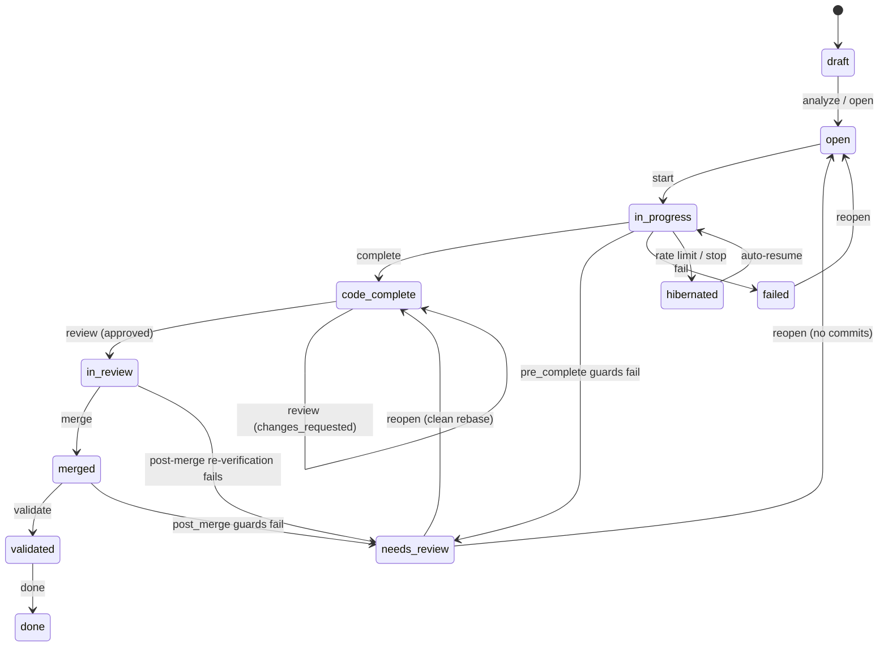

# Ticket Lifecycle

The complete state machine: every status, the command that causes each transition, the gate that can block it, and where a ticket lands when a gate fails.

The [README](../README.md#concepts-in-30-seconds) shows the happy path as a command sequence. This document adds the failure edges, which is where most of the behavior actually lives.

---

## Statuses

| Group | Statuses | Meaning |
|---|---|---|
| **Pre-work** | `draft`, `open`, `backlog`, `deferred`, `blocked` | Not yet claimed. `blocked` means unresolved `depends_on`. |
| **Active** | `in_progress`, `code_complete`, `in_review` | A worktree exists and the ticket's `touches` are locked. |
| **Paused** | `hibernated`, `needs_review` | Work is suspended, waiting on a rate limit or a human. |
| **Terminal** | `merged`, `validated`, `done`, `failed`, `closed` | No further automatic transitions. |

Two sets matter for coordination:

- **Lock statuses** — `in_progress`, `code_complete`, `in_review` hold the ticket's file locks. Another ticket cannot claim those paths while any of these is active.
- **Dependency-satisfied statuses** — `merged`, `validated`, `done`. A ticket `blocked` on a dependency unblocks only when its dependency reaches one of these.

---

## Main path



---

## Transitions in detail

### `analyze` / `open` — `draft → open`

`lanegate analyze` asks an executor to infer `touches` and `close_criteria` from the ticket body. `lanegate open` performs the same transition without re-running analysis, and refuses if `touches` is empty — `lanegate start` would reject an empty-touches ticket anyway.

### `start` — `open → in_progress`

Creates a git worktree under `.lanegate/worktrees/tick-NNN/` and a branch, then claims the ticket's `touches`. The claim is atomic under a lock file: a conflicting claim is refused outright rather than merged, so two tickets can never hold the same path.

### `complete` — `in_progress → code_complete`

Three checks run in order, and the first failure decides the outcome:

1. **Worktree present.** A ticket whose worktree was deleted refuses to advance — run `lanegate reopen` to reset it.
2. **Touches-compliance check.** If the branch modified files outside the ticket's declared `touches`, the command **blocks and exits nonzero**; the ticket stays `in_progress`. Override with `--allow-drift`, or fold the new paths in with `--auto-update-touches`.
3. **`pre_complete` safeguards.** On failure the ticket is routed to **`needs_review`** with the failing guard recorded — not left `in_progress`.

Note the asymmetry: scope drift blocks in place, a failing guard moves the ticket. Drift is a spec disagreement a human should settle; a failing test is a work state.

### `review` — `code_complete → in_review`

`lanegate review TICK-NNN` runs the reviewer agent, or a human records a verdict directly with `--verdict`.

- **`approved`** → status becomes `in_review`, `review_verdict=approved`. Merge-eligible.
- **`changes_requested`** → status **stays `code_complete`** with `review_verdict=changes_requested`. This is what keeps the merge gate closed, so don't hand-edit it away.

### The auto-fix sub-loop

On `changes_requested`, LaneGate runs up to **`max_auto_fix_attempts`** (default **`1`**) cycles of **fix → drift-check → re-review**. If that budget is exhausted, the rejected ticket remains a lock-holding continuation candidate: a later `lanegate run` resumes it through another bounded fix cycle instead of leaving its touches to block the board indefinitely. `needs_review` remains a human-only escalation and is never resumed this way.

Each continuation pass sees **at most two review runs** by default: the prior review plus one re-review. Raise `max_auto_fix_attempts` for more retries within a pass.

This cycle **always runs, regardless of `autonomy`.** What `autonomy` decides is what happens to a successful result:

| `autonomy` | On re-review approval |
|---|---|
| `full` | Proceeds straight to merge, unattended |
| `supervised` (default) | Lands at `in_review`, waits for an explicit human verdict |
| `manual` | Lands at `in_review`, waits for an explicit human verdict |

Three ways the cycle stops early:

- **Drift-check failure** — the fix wandered outside the ticket's intent. This is **fail-closed and immediate**: it does not spend a remaining attempt, is never auto-resumed, and requires a human.
- **Empty findings** — a `changes_requested` verdict with no findings to act on is treated as a harness error rather than a rejection, so no fix is attempted.
- **Budget exhausted** — attempts run out.

In every escalation the ticket is left at `code_complete` / `changes_requested`, with one `## Auto-Fix Attempt N` section per attempt in the body and a `review_summary` explaining the escalation.

`lanegate fix TICK-NNN` runs this same cycle out-of-band — useful after a human recorded a verdict with `lanegate review` directly.

### `merge` — `in_review → merged`

A hard gate with no override flag. The command refuses unless status is `in_review` **and** `review_verdict` is `approved`.

Then, in order:

1. `pre_merge` guards run in the ticket's isolated worktree.
2. The branch merges to the trunk branch.
3. **`pre_merge` guards re-run against the merged result** — the actual trunk checkout, not the worktree.

Step 3 is the one most tools skip. Two tickets can each pass on their own branch and still break once combined; only a run against the merge result catches it. If that run fails, LaneGate **resets the trunk branch to its pre-merge commit** and downgrades the ticket to `needs_review` / `changes_requested`, rather than leaving a broken commit behind.

With no `pre_merge` guards configured this step is a no-op. See [config-reference.md](config-reference.md#pre_merge-re-verification-against-the-actual-merge-result).

### `validate` — `merged → validated`

Runs `post_merge` guards from the **merged control checkout**, not a worktree. This is the only stage with the real merged tree available, so it's where integration tests, migrations, and anything needing a live service belong.

On failure the ticket routes to `needs_review`.

### `done` — `validated → done`

If any effective `post_merge` guards are configured, `done` requires the ticket to have passed `validate` first and refuses a direct `merged → done`. With no `post_merge` guards, `merged → done` remains available.

---

## Paused states and recovery

### `hibernated`

Entered when an executor hits a rate limit (with `on_rate_limit: resume`) or when you run `lanegate stop`. On auto-resume the worktree is first **rebased onto the trunk branch** so work doesn't resume against a stale base. A rebase conflict spawns a dedicated fix agent to resolve the markers and continue; use `lanegate run --pool NAME` to select its executor. If that fails, the rebase is aborted and the ticket pauses for a human.

### `needs_review`

The human-safety state. A ticket lands here from a failing `pre_complete` guard, a failing `post_merge` guard, a failed post-merge re-verification, or a pre-flight gate that blocked dispatch.

`lanegate reopen` branches on whether the worktree contains real commits:

| Worktree state | Result |
|---|---|
| No commits — never got past a pre-flight gate | Stale worktree and branch are cleaned up; ticket resets to `open` for fresh dispatch |
| Real commits — implemented, then downgraded by a gate | Worktree is preserved and ticket resets to `code_complete` so `review` can pick it up, clearing `review_verdict`/`review_summary` since the human is overriding the gate. `reopen` never rebases or dispatches an agent |

`reopen` is a lifecycle command, not a work-execution command: it never invokes an executor. Rebase-and-fix is limited to the explicit hibernated-resume orchestration flow.

For a real-commit `needs_review` ticket that needs its branch brought current, run
`lanegate resolve-conflict TICK-NNN --pool codex`. This explicit work command rebases the
branch and only dispatches a fix agent if Git reports a content conflict. A clean rebase or
successful agent resolution restores the ticket to `code_complete`; otherwise it aborts the
rebase and leaves the ticket in `needs_review`.

### Other recovery commands

| Command | Effect |
|---|---|
| `lanegate fail TICK-NNN` | `in_progress → failed`, terminal. Releases the worktree lock so the `touches` are freed. Preserves the worktree when `review_verdict=changes_requested`, for inspection. |
| `lanegate reopen TICK-NNN` | From `failed` → `open`. From `hibernated` → `open` if the worktree has no commits; worktrees with real commits are preserved for `start` to resume. |
| `lanegate supersede TICK-NNN` | `→ closed` when the work already exists elsewhere — the branch is already an ancestor of the trunk, or a merged ticket covers the same intent. Records `replacement_commit` / `equivalent_ticket_id` as evidence. Refuses without evidence unless given an explicit human `--reason`. |

---

## Where rebase happens — and where it doesn't

Rebase-onto-trunk runs in exactly two places:

- resuming a `hibernated` ticket
- `reopen` on a `needs_review` ticket that has real commits

It is **not** part of the normal approve → merge path, and LaneGate never back-merges the trunk into a ticket branch. Staleness is handled at the other end instead: the branch merges as-is, and `pre_merge` guards re-run against the merged result, with a rollback if that fails.

The tradeoff is deliberate. Keeping every in-flight branch continuously fresh costs a rebase per ticket per trunk commit and creates conflicts in work that was already finished. Verifying the combination once, at merge time, catches the same class of breakage at the moment it becomes real.

---

## Config knobs that change this flow

Mapped onto the stages above, a complete `.lanegate.yml` looks like this:

```yaml
max_auto_fix_attempts: 1        # review rounds = this + 1

safeguards:
  pre_complete:                 # in_progress -> code_complete, in the worktree
    - pytest tests/unit
  pre_merge:                    # in_review -> merged, worktree AND merged trunk
    - pytest
  post_merge:                   # merged -> validated, from the merged checkout
    - make integration-test
  timeout_s: 1800               # no timeout by default — set one
  retry_on_failure: 1           # 0 by default; only pass/fail matters
```

The split follows from where each stage runs and how often:

- **`pre_complete`** runs once per completion attempt, in an isolated worktree with no services around it. Unit tests belong here — this is the fastest feedback loop, and a failure routes the ticket to `needs_review` rather than blocking in place.
- **`pre_merge`** runs **twice per ticket** — once in the worktree, once against the merged trunk. Budget for that: the wall-clock cost is doubled. It's still the right place for the full unit and integration-lite suite, since it's the gate protecting the trunk branch.
- **`post_merge`** runs once, from the merged control checkout, which is the only stage with a real merged tree. Anything needing a database, migrations, a built artifact, or a service on a port goes here.

Guards are deterministic subprocesses run with `shell=False` — no model is involved at any stage, so guard cost is CPU and wall-clock, never tokens. The token levers are `max_auto_fix_attempts` and the review runs themselves. Because there's no shell, pipes, `&&`, globs, and env interpolation don't work; wrap those in a script and reference it (`scripts/run-tests.sh`).

One thing to decide deliberately: configuring **any** effective `post_merge` guard makes `lanegate validate` mandatory before `done`. Leaving `post_merge` unset keeps `merged → done` available as a direct transition.

Also note that `pre_merge` already re-runs against the merged trunk. Setting `post_merge` to the same command as `pre_merge` re-runs an identical suite against an identical tree seconds later — if `post_merge` isn't doing something structurally different, leave it unset.

| Key | Default | Effect |
|---|---|---|
| `max_auto_fix_attempts` | `1` | Fix → drift-check → re-review cycles on `changes_requested`. Total review runs is this plus one. |
| `autonomy` (per ticket) | `supervised` | Whether an auto-fix approval merges unattended or waits for a human verdict. |
| `safeguards.pre_complete` | none | Guards before `code_complete`. Failure routes to `needs_review`. |
| `safeguards.pre_merge` | none | Guards before merge **and** against the merge result. Runs twice per ticket, so keep it fast. |
| `safeguards.post_merge` | none | Guards during `validate`, from the merged checkout. Where slow integration work belongs. Configuring any makes `validate` mandatory before `done`. |
| `safeguards.timeout_s` | no timeout | Kills a hanging guard. Timeouts are fatal and never retried. |
| `safeguards.retry_on_failure` | `0` | Re-runs a failing guard N times before treating it as failed. |
| `on_rate_limit` | `resume` | `resume` hibernates and auto-resumes; `halt` stops the run. |
| `lock_statuses` | `in_progress`, `code_complete`, `in_review` | Which statuses hold `touches` locks. |

See [config-reference.md](config-reference.md) for the full set.
